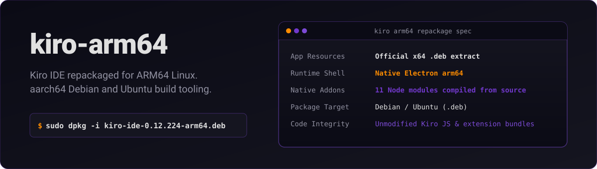
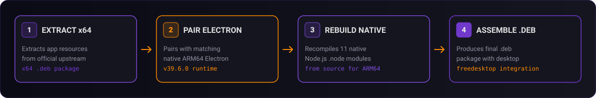

<p align="center">
  
</p>

<p align="center">
  <a href="https://kiro.dev">
    
  </a>
  <a href="https://electronjs.org">
    
  </a>
  
  <a href="LICENSE">
    
  </a>
</p>

---

## Overview

Kiro IDE is an AI-powered development environment created by Amazon. Official releases target x86-64 Linux systems exclusively.

This community project provides clean build tooling to repackage official Kiro IDE releases for ARM64 (aarch64) Debian and Ubuntu hardware:

1. **Extract**: Extracts architecture-independent app resources from the official x64 `.deb` package.
2. **Pair**: Pairs extracted resources with a native ARM64 Electron shell matching upstream version 39.6.0.
3. **Rebuild**: Recompiles all 11 native Node.js `.node` modules from source for ARM64.
4. **Assemble**: Generates a standard `.deb` package complete with desktop integration and application icons.

> **Source Integrity**: No Kiro source code is altered. JavaScript, HTML, and extension bundles remain byte-identical to upstream releases.

<br />

<p align="center">
  
</p>

---

## Quick Installation

Download the latest `.deb` package from Releases, then install via `dpkg`:

```bash
sudo dpkg -i kiro-ide-0.12.224-arm64.deb
```

Alternatively, run the included interactive TUI installer script:

```bash
bash install.sh --local kiro-ide-0.12.224-arm64.deb
```

Launch `kiro` from your desktop application menu or terminal after installation completes.

---

## Build from Source

### System Prerequisites
- Debian or Ubuntu ARM64 (aarch64) system
- Node.js 20 or newer
- Standard build tools (`build-essential`, `make`, `python3`)
- Approximately 4 GB free disk space

### Full Build Process

Clone the repository:

```bash
git clone https://github.com/ChloeVPin/kiro-arm64.git
cd kiro-arm64
```

Download the official Kiro x64 `.deb` from [kiro.dev](https://kiro.dev) into `~/Downloads/`, then run:

```bash
make all
```

The completed package outputs to `build/dist/`. A full build typically completes within 2 minutes.

### Granular Build Stages

Individual pipeline stages can be executed independently:

| Makefile Target | Description |
|---|---|
| `make prereqs` | Install system dependencies via apt and Node.js package tools. |
| `make fetch` | Locate the upstream x64 `.deb` file in your Downloads directory. |
| `make extract` | Unpack application resources and detect target Electron version. |
| `make electron` | Download matching native ARM64 Electron runtime shell. |
| `make natives` | Recompile all 11 native Node.js C++ modules from source for ARM64. |
| `make assemble` | Combine Electron runtime, application bundle, and compiled modules. |
| `make icons` | Generate PNG application icon assets from source SVG artwork. |
| `make deb` | Produce the final Debian `.deb` package file. |

### Utility Targets

```bash
make verify      # Inspect binary architecture of every compiled .node addon
make install     # Install the compiled package via sudo dpkg
make uninstall   # Remove installed kiro-ide package from system
make clean       # Remove all build outputs and temporary directories
make clean-soft  # Remove build outputs while retaining cached downloads
```

---

## Rebuilt Native Addons

The following 11 native Node.js C++ addons are recompiled from source for ARM64 architecture:

| Native Module | Functional Purpose |
|---|---|
| `@parcel/watcher` | High-performance filesystem event watching |
| `native-keymap` | Keyboard layout and keycode detection |
| `native-watchdog` | Process health and watchdog monitoring |
| `native-is-elevated` | System privilege and root detection |
| `node-pty` | Pseudoterminal emulation for integrated terminal |
| `kerberos` | Enterprise Kerberos authentication protocols |
| `windows-foreground-love` | Window focus handling (Linux stub) |
| `@vscode/spdlog` | High-speed structured C++ logging framework |
| `@vscode/sqlite3` | Local database storage layer |
| `@vscode/deviceid` | System device identifier generation |
| `@vscode/policy-watcher` | Enterprise policy configuration monitoring |

`@lancedb/vectordb-linux-arm64-gnu` is pulled directly from its published ARM64 distribution, and `onnxruntime-node` includes upstream ARM64 binaries.

---

## Repository Architecture

```text
kiro-arm64/
  assets/              Source SVG logo and generated artwork
  packaging/           Debian control files and freedesktop entry
  scripts/             Modular build automation pipeline scripts
    00-prereqs.sh      Install build dependencies
    10-fetch-source.sh Locate upstream .deb archive
    20-extract-source  Extract app bundle and detect versions
    30-fetch-electron  Download ARM64 Electron runtime
    40-rebuild-natives Recompile C++ Node.js addons for ARM64
    50-assemble.sh     Assemble Electron runtime and app bundle
    60-generate-icons  Rasterize SVG logo into PNG desktop icons
    70-build-deb.sh    Package final .deb installer
    build-all.sh       Full build pipeline orchestrator
    clean.sh           Build cleanup utility script
  src/
    native-rebuild/    Pinned native module package definitions
  config.sh            Tunable build parameters and environment options
  install.sh           Interactive TUI installer
  Makefile             Convenience targets and build orchestration
  VERSION              Target Kiro release version string
```

---

## Tested Hardware Compatibility

- Snapdragon X Elite (Dell XPS 13 9345) running Ubuntu 26.04 ARM64

Compatible with general ARM64 Debian and Ubuntu distributions.

---

## Disclaimers & License

### Disclaimers
This is an **unofficial** community project. Kiro IDE is a proprietary product developed by Amazon. This repository provides build automation tooling and packaging scripts only. Kiro IDE software is not bundled and must be obtained directly from [kiro.dev](https://kiro.dev).

The Kiro trademark and logo belong to Amazon and are used strictly for application icon generation. No affiliation or endorsement by Amazon is implied.

### License
- Build Tooling &amp; Scripts: [MIT License](LICENSE)
- Kiro IDE Application: Governed by Amazon [Terms of Service](https://kiro.dev)
